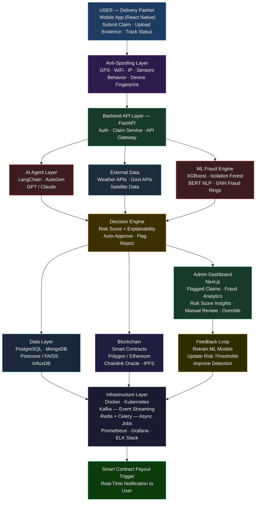

Trailz--Devtrails-26
Git hub repository from Team mebers :- P.Harsha datta,A.Naga koushtub,B.Balavignesh, Ananya Kavuri, K. Sahithi Reddy
#  AI-Powered Insurance Claim Verification System  
### DEVTrails 2026 — Phase 1 Submission  

**Parametric Insurance • Fraud Detection • Anti-Spoofing • Blockchain Settlement**

---
##  Problem Overview

Gig economy delivery partners lose up to 30% of their income due to uncontrollable events like floods, heavy rain, and curfews.

Existing insurance systems:
- Are slow  
- Require manual verification  
- Are vulnerable to fraud  

We solve this using:
- AI-driven real-time verification  
- Fraud-resistant architecture  
- Blockchain-backed transparency  

It is specifically designed to resist advanced adversarial attacks, including coordinated GPS spoofing syndicates.  

---

##  Target Users

Our primary users are gig economy delivery partners working with platforms like:
- Swiggy
- Zomato
- Amazon
- Zepto

### Key Challenges Faced:
- Income loss during extreme weather
- No financial protection during curfews
- No trust in claim approval systems

Our system ensures:
- Instant financial protection
- Fair and transparent claim verification
---

##  Scenario 1: Flood-Affected Delivery Partner

### Persona: Ayesha (Urban Delivery Worker)
- Location: Mumbai (flood-prone area)
- Works during peak hours

### Situation:
Heavy rainfall causes sudden flooding in her delivery zone.

- Roads blocked  
- Orders cancelled  
- Cannot continue work  

### System Response:
- AI detects flood alerts from weather APIs  
- Validates her movement stoppage  
- Confirms location consistency  

✅ Claim approved automatically  

---

##  Scenario 2: Curfew Restriction Case

### Persona: Arjun (Night Shift Delivery Partner)
- Works late-night shifts  

### Situation:
Government imposes sudden curfew due to emergency.

- Orders stop instantly  
- Cannot operate legally  

### System Response:
- AI fetches government restriction data  
- Verifies timestamp with curfew start  
- Matches user activity pattern  

✅ Claim approved  

---

##  Scenario 3: GPS Spoofing Fraud Attempt ❌

### Persona: Fake User (Fraud Attempt)

### Situation:
User stays at home and uses a GPS spoofing app  
to fake location in a heavy rain zone.

### System Detection:
- GPS shows rain zone  
- BUT:
  - No movement detected  
  - WiFi & IP mismatch  
  - No sensor activity  
  - No environmental consistency  

❌ Claim rejected  

 Fraud prevented  

---

##  Scenario 4: Coordinated Fraud Attack 🚨

### Persona: Fraud Group (10+ users)

### Situation:
Multiple users submit claims simultaneously  
from the same spoofed location.

### System Detection:
- Identical timestamps  
- Same location patterns  
- Network similarity  

### ML Response:
- Graph-based fraud detection triggers  
- Cluster anomaly detected  

 All claims flagged  
 Sent for investigation  

---

##  Scenario 5: Genuine User with Network Failure 

### Persona: Kiran (Rural Delivery Partner)

### Situation:
Heavy rain causes poor network connectivity.

- Delayed claim submission  
- Incomplete sensor data  

### System Response:
- Allows delayed submission  
- Uses weather API validation  
- Uses partial data fallback  

✅ Claim approved (no penalty)  

 Ensures fairness  

---

##  Scenario 6: Partial Fraud / Suspicious Case ⚠️

### Persona: Rahul

### Situation:
User submits claim during moderate rain  
but exaggerates impact.

### System Detection:
- Weather data = moderate rain  
- Behavior slightly inconsistent  

### Response:
⚠️Claim flagged  
 Requests additional proof  

 Prevents misuse without rejection  

---

##  Scenario 7: High-Risk Zone Frequent Claims

### Persona: Imran

### Situation:
User frequently submits claims from same location.

### System Detection:
- Pattern repetition  
- High claim frequency  

### ML Response:
- Risk score increases  
- Requires stricter validation  

 Moves to higher verification tier  

---

##  Scenario 8: Real-Time Movement Validation

### Persona: Sneha

### Situation:
User is actively delivering when rain starts.

### System Detection:
- Continuous movement pattern  
- Gradual slowdown due to weather  

### Response:
- Matches real-world behavior  
- Confirms authenticity  

✅ Claim approved instantly  

---

##  Scenario 9: Indoor Spoof Detection 

### Persona: Fraud Attempt

### Situation:
User claims to be in heavy rain outdoors  
but is actually inside home.

### System Detection:
- Barometer shows stable indoor pressure  
- No motion detected  
- No environmental noise  

❌ Claim rejected  

---
##  How Our AI Works (Simple View)

Our system uses a multi-step AI validation pipeline:

1.  Claim is submitted by user  
2.  AI Agent collects real-world data (weather + govt alerts)  
3.  ML models analyze:
   - Location consistency
   - Movement behavior
   - Fraud patterns  
      NLP checks if user description matches real conditions  
5.  Decision engine classifies:
   -  Genuine claim  
   -  Suspicious  
   -  Fraud  

---
##  Weekly Premium Model

ShieldRide follows a **parametric insurance model**:

- Users pay a small weekly premium  
- Premium is dynamically calculated based on:
  - Location risk (flood-prone areas)
  - Weather patterns  
  - Work frequency  

### Example:
- Low-risk zone → ₹20/week  
- Medium-risk zone → ₹40/week  
- High-risk zone → ₹60/week  

### Trigger-Based Payout:
If predefined conditions are met:
- Heavy rain (> X mm)
- Flood alert issued  
- Government curfew  

 Claim is automatically eligible for payout
##  Deployment Strategy

We choose a **mobile-first approach** using React Native because:

- Delivery partners primarily use smartphones  
- Real-time notifications are critical  
- Easy access during working hours  

Backend is deployed on cloud infrastructure (Render/Kubernetes) for:
- Scalability  
- Real-time processing  
- High availability  

Ensures fast, reliable, and accessible service

##  Smart Premium Calculation

Premium is calculated using AI-driven risk scoring:

### Factors Considered:
- Historical weather data  
- User activity patterns  
- Location-based risk  
- Claim history  

### Model Used:
- Regression models (XGBoost)  
- Risk scoring algorithms  

 Result:
- Fair pricing  
- Personalized premiums  
- Reduced fraud exploitation

##  Technical Stack  

### AI Agent Layer  
LangChain, AutoGen, GPT-4 / Claude, OpenWeather API, Government APIs  

### Machine Learning Layer  
XGBoost, Isolation Forest, BERT, Graph Neural Networks, MLflow  

### Blockchain Layer  
Ethereum / Polygon, Solidity, Chainlink, IPFS  

### Backend Layer  
FastAPI, Kafka, Celery + Redis, JWT, NGINX  

### Database Layer  
PostgreSQL, MongoDB, Pinecone / FAISS, InfluxDB  

### Frontend Layer  
React Native, Next.js, Socket.io, Tailwind CSS  

### Infrastructure  
Docker, Kubernetes, Vercel, Render, Prometheus, Grafana, ELK, GitHub Actions  

# Adversarial Defense & Anti-Spoofing Strategy

**Core Principle:**  
GPS is treated as a weak, forgeable signal.  
The system relies on multi-layer corroboration using independent and hard-to-fake signals.

---

##  1. Genuine Partner vs GPS Spoofer

###  Key Insight
The system does not trust GPS alone — it corroborates it with multiple signals.

---

###  1.1 Multi-Layer Location Corroboration

Each claim must pass the following verification layers:

- **Wi-Fi & Cell Tower Triangulation**
  - Captures nearby SSIDs & tower IDs
  - Detects mismatch between claimed and actual environment

- **IP Geolocation Cross-Check**
  - Compares public IP location with GPS
  - Flags VPN/proxy usage

- **Barometric Pressure Sensor**
  - Verifies outdoor weather consistency
  - Detects indoor vs outdoor conditions

- **Motion Sensors (Accelerometer & Gyroscope)**
  - Identifies real-world movement patterns
  - Detects stationary spoofing behavior

- **Camera-Based Verification (Optional)**
  - Short ambient video validation
  - Detects rain, flood, low visibility (no biometric storage)

---

###  1.2 Behavioural Baseline Comparison

Each partner has a historical movement profile:
- Typical routes
- Average speeds
- Working hours
- Dwell locations

**Fraud Signal:**  
Sudden teleportation → highly suspicious

---

###  1.3 Environmental Ground-Truth Validation

Before device data is considered:

- Weather APIs (OpenWeather, satellite data)
- Government curfew/restriction APIs

**Auto-Reject Rule:**  
Claims are rejected if no real-world event exists.

---

##  2. Data Signals & Spoofing Resistance

| Category | Data Points | Resistance |
|----------|------------|------------|
| GPS | Coordinates, altitude, accuracy | LOW |
| Network | Wi-Fi, BSSID, cell towers, IP | HIGH |
| Sensors | Barometer, accelerometer, gyro | HIGH |
| Temporal | Timing vs shift schedule | MEDIUM |
| Behaviour | Historical patterns | HIGH |
| External APIs | Weather, curfew, flood data | VERY HIGH |
| Social Graph | Group patterns, timestamps | VERY HIGH |
| NLP | Claim text analysis | MEDIUM |

---

##  3. Coordinated Ring Detection

###  Graph-Based Fraud Detection

- **Nodes** → Delivery partners  
- **Edges** → Shared patterns:
  - Same timestamps
  - Same locations
  - Same network signals
  - Social links

**Alert Trigger:**
- ≥10 accounts
- ≥85% correlated timing

 Automatic payout freeze + investigation

---

##  4. UX Design: Protecting Honest Workers

###  4.1 Trust Tier Model

| Tier | Profile | Verification Needed | Fraud Threshold |
|------|--------|--------------------|----------------|
| Tier 1 | Trusted (12+ months) | 2 signals | 5+ flags |
| Tier 2 | Standard | 3 signals | 3+ flags |
| Tier 3 | New/Flagged | 4+ signals | 1+ flag |

---

###  4.2 Graduated Response Workflow

1. **Auto-Approve**
   - No anomalies → instant payout

2. **Soft Flag**
   - Minor mismatch
   - Request additional proof
   - Hold ≤ 4 hours

3. **Manual Review**
   - Multiple anomalies
   - Human + AI explainability report
   - SLA: 24 hours

4. **Auto-Reject**
   - Strong fraud signals
   - Appeal always allowed

---

### 4.3 Network Drop Tolerance

Designed for real-world conditions:

- 90-min delayed submission allowed
- Sparse sensor data NOT penalized
- Falls back to environmental APIs
- Full audit trail for appeals

---

## Design Principle: Explainability

- No black-box decisions  
- Every output includes:
  - Signal breakdown
  - Reason for decision  

**Human review always available**  
**Appeals guaranteed**

---
# System Architecture

---
##  Phased Development Plan

### Phase 1 (Current - Hackathon)
- System design & architecture  
- Basic frontend prototype  
- Fraud detection logic  
- Anti-spoofing design  

### Phase 2
- Backend API implementation  
- AI model integration  
- Real-time data pipelines  

### Phase 3
- Blockchain smart contract deployment  
- Payment automation  
- Full mobile app release  

### Phase 4
- Advanced fraud detection (GNN)  
- Scaling & production deployment  

  ##  Core Innovation

> **"We don't trust location — we trust behavior."**

Our system validates claims using **behavioral patterns**, **environmental data**, and **multi-source verification** instead of relying on easily spoofed GPS signals.
